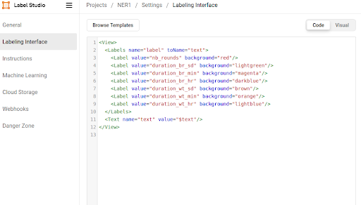
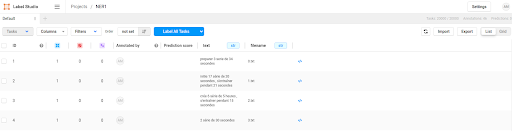
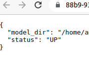
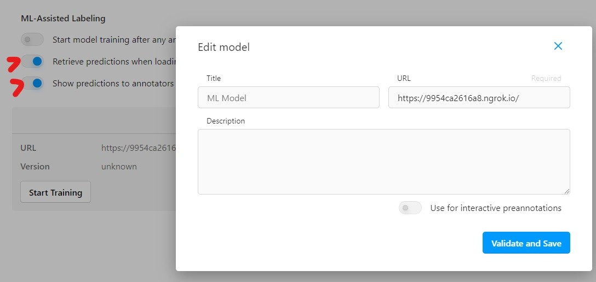
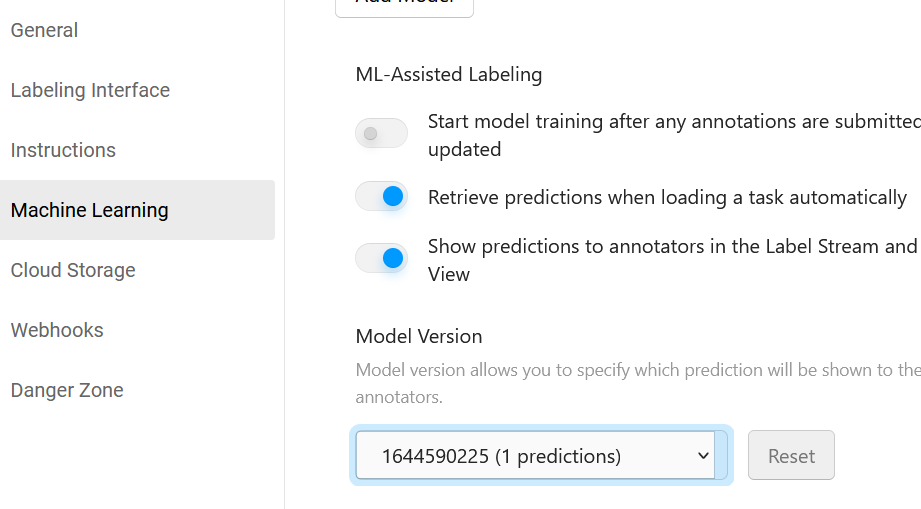
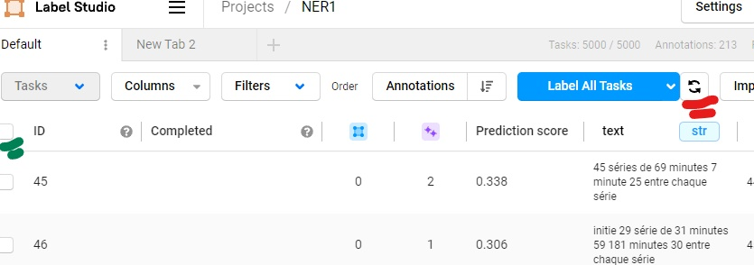
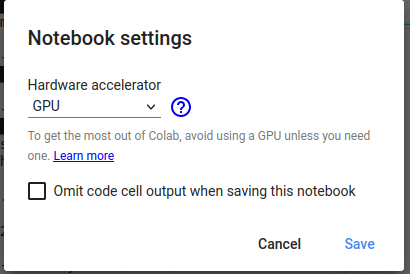
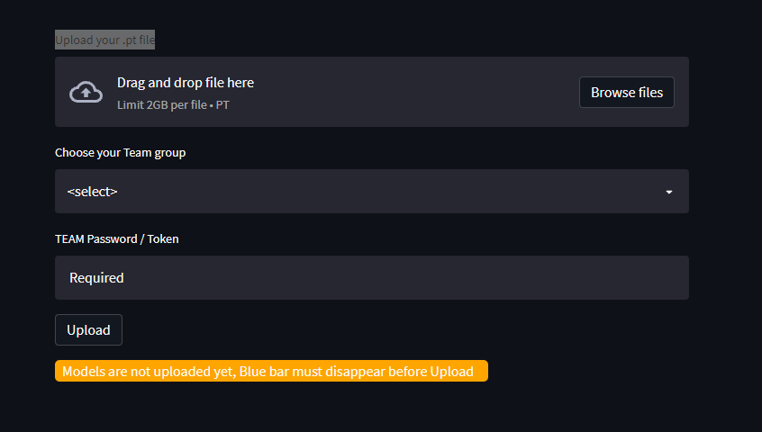

# EFR-CAMP setup tutorial <a name="home"></a>

# Table of contents
2. [Start / Expose labelstudio](#2)
3. [Configure labelstudio](#3)
4. [load data in labelstudio](#4)
5. [Setup / Connect ML backend To labelstudio](#5)
6. [Prepare Labeled data for training](#6)
7. [Train / Optimize / Monitor](#7)
8. [Inference (test model)](#8)
9. [prepare Inference API](#9)
10. [Test API, push to evaluator](#10)

#### 🔴🔴🔴🎥 a Video tutorial of bellow steps <a href="https://youtu.be/FG6VuPtElHw" target="_blank">Here</a>

[back to top](#home)
## 2.   Start / Expose labelstudio (local PC) - One user per Team <a name="2"></a>

- Copy one Authtoken from your Ngrok account, open ngrok_LS.yml and replace "YOUR_ND_AUTHTOKEN"
- Put your ngrok.exe in the project folder
- To start Labelstudio, open terminal, change dir to your current project and run these commands :
  - Linux
    ```
    cd path_to_EFREI_CAMP/
    ./ngrok start --config=ngrok_LS.yml labelstudio #use the shown url in the next command
    ```
   - Windows
        ```
        cd path_to_EFREI_CAMP/
        ngrok start --config=ngrok_LS.yml labelstudio
        ```
        NOTE : To restart ngrok in Windows (if you have an error), you may need to kill it
        ```
        taskkill /f /im ngrok.exe
        ```
- Copy the Ngrok url shown in the first terminal "https://....ngrok.io" to run Labelstudio, open another terminal :
  - Linux
    ```
    cd labelstudioUI
    LABEL_STUDIO_HOST=https://....ngrok.io
    docker-compose up
    ```
  - Windows
    ```
    cd labelstudioUI
    docker run -it -p 9999:9999 -v "%cd%"/mydata:/label-studio/data heartexlabs/label-studio:1.4.0 /bin/bash -c "label-studio start --port 9999"
    ```
The Labelstudio Web app can be accessible on this link https://....ngrok.io

- Signup and create your own account (no verification needed)
  - Tip : no need to use your real email or password

[back to top](#home)

## 3.   Configure labelstudio (as a Team) <a name="3"></a>

1. Create new project and give it a name (Ex. NER1), click save

2. In Labeling Interface, use this template (to copy/paste)

    Open the project > Settings > Labelling Interface and copy/paste the xml below. It contains the entities that will be used for text labelling and click save
    ```
    <View>
      <Labels name="label" toName="text">
        <Label value="nb_rounds" background="red"/>
        <Label value="duration_wt_sd" background="#88CCEE"/>
        <Label value="duration_wt_min" background="#009E73"/>
        <Label value="duration_wt_hr" background="#0072B2"/>
        <Label value="duration_br_sd" background="#E69F00"/>
        <Label value="duration_br_min" background="#D55E00"/>
        <Label value="duration_br_hr" background="#F0E442"/>
      </Labels>
      <Text name="text" value="$text"/>
    </View>
    ```



3. In settings > General, select sequential sampling and save

4. In settings > Instructions, copy paste :
    ```
    <h3>Entities definition</h3>
    <table border="1">
      <thead>
        <tr>
          <th>tag</th>
          <th> meaning</th>
        </tr>
      </thead>
      <tbody>
        <tr>
          <td>nb_rounds</td>
          <td> Number of rounds</td>
        </tr>
        <tr>
          <td>duration_br_sd</td>
          <td> Duration btwn rounds in seconds</td>
        </tr>
        <tr>
          <td>duration_br_min</td>
          <td> Duration btwn rounds in minutes</td>
        </tr>
        <tr>
          <td>duration_br_hr</td>
          <td> Duration btwn rounds in hours</td>
        </tr>
        <tr>
          <td>duration_wt_sd</td>
          <td> workout duration in seconds</td>
        </tr>
        <tr>
          <td>duration_wt_min</td>
          <td> workout duration in minutes</td>
        </tr>
        <tr>
          <td>duration_wt_hr</td>
          <td> workout duration in hours</td>
        </tr>
      </tbody>
    </table>
    <br>
    <h3>Annotated sentences examples</h3>
    <ul>
      <li style='list-style-type: circle'>
        <div class="entities" style="line-height: 2.5; direction: ltr">prépare <mark class="entity" style="font-size: 0.7em; background: #FBD5D5; padding: 0.2em 0.1em; margin: 0 0.015em; line-height: 0.8; border-radius: 0.35em;">1 <sup>
              <span style="font-size: 0.6em; font-weight: bold; line-height: 0.6; border-radius: 0.35em; vertical-align: middle; margin-left: 0.15rem">NB_ROUNDS</span>
            </sup>
          </mark> séries de <mark class="entity" style="font-size: 0.7em; background: #E9F3F8; padding: 0.2em 0.1em; margin: 0 0.015em; line-height: 0.8; border-radius: 0.35em;">80 <sup>
              <span style="font-size: 0.6em; font-weight: bold; line-height: 0.6; border-radius: 0.35em; vertical-align: middle; margin-left: 0.15rem">DURATION_WT_SD</span>
            </sup>
          </mark> secondes </div>
      </li>
      <li style='list-style-type: circle'>
        <div class="entities" style="line-height: 2.5; direction: ltr">génère <mark class="entity" style="font-size: 0.7em; background: #FBD5D5; padding: 0.2em 0.1em; margin: 0 0.015em; line-height: 0.8; border-radius: 0.35em;">41 <sup>
              <span style="font-size: 0.6em; font-weight: bold; line-height: 0.6; border-radius: 0.35em; vertical-align: middle; margin-left: 0.15rem">NB_ROUNDS</span>
            </sup>
          </mark> série de <mark class="entity" style="font-size: 0.7em; background: #E9F3F8; padding: 0.2em 0.1em; margin: 0 0.015em; line-height: 0.8; border-radius: 0.35em;">78 <sup>
              <span style="font-size: 0.6em; font-weight: bold; line-height: 0.6; border-radius: 0.35em; vertical-align: middle; margin-left: 0.15rem">DURATION_WT_SD</span>
            </sup>
          </mark> seconde <mark class="entity" style="font-size: 0.7em; background: #F5E3D5; padding: 0.2em 0.1em; margin: 0 0.015em; line-height: 0.8; border-radius: 0.35em;">233 <sup>
              <span style="font-size: 0.6em; font-weight: bold; line-height: 0.6; border-radius: 0.35em; vertical-align: middle; margin-left: 0.15rem">DURATION_BR_MIN</span>
            </sup>
          </mark> minute <mark class="entity" style="font-size: 0.7em; background: #F7EDD5; padding: 0.2em 0.1em; margin: 0 0.015em; line-height: 0.8; border-radius: 0.35em;">20 <sup>
              <span style="font-size: 0.6em; font-weight: bold; line-height: 0.6; border-radius: 0.35em; vertical-align: middle; margin-left: 0.15rem">DURATION_BR_SD</span>
            </sup>
          </mark> entre séries </div>
      </li>
      <li style='list-style-type: circle'>
        <div class="entities" style="line-height: 2.5; direction: ltr">
          <mark class="entity" style="font-size: 0.7em; background: #FBD5D5; padding: 0.2em 0.1em; margin: 0 0.015em; line-height: 0.8; border-radius: 0.35em;">23 <sup>
              <span style="font-size: 0.6em; font-weight: bold; line-height: 0.6; border-radius: 0.35em; vertical-align: middle; margin-left: 0.15rem">NB_ROUNDS</span>
            </sup>
          </mark> sets de <mark class="entity" style="font-size: 0.7em; background: #D5EDE6; padding: 0.2em 0.1em; margin: 0 0.015em; line-height: 0.8; border-radius: 0.35em;">17 <sup>
              <span style="font-size: 0.6em; font-weight: bold; line-height: 0.6; border-radius: 0.35em; vertical-align: middle; margin-left: 0.15rem">DURATION_WT_MIN</span>
            </sup>
          </mark> minute <mark class="entity" style="font-size: 0.7em; background: #F7EDD5; padding: 0.2em 0.1em; margin: 0 0.015em; line-height: 0.8; border-radius: 0.35em;">93 <sup>
              <span style="font-size: 0.6em; font-weight: bold; line-height: 0.6; border-radius: 0.35em; vertical-align: middle; margin-left: 0.15rem">DURATION_BR_SD</span>
            </sup>
          </mark> seconde entre chaque série
        </div>
      </li>
      <li style='list-style-type: circle'>
        <div class="entities" style="line-height: 2.5; direction: ltr">initie <mark class="entity" style="font-size: 0.7em; background: #FBD5D5; padding: 0.2em 0.1em; margin: 0 0.015em; line-height: 0.8; border-radius: 0.35em;">25 <sup>
              <span style="font-size: 0.6em; font-weight: bold; line-height: 0.6; border-radius: 0.35em; vertical-align: middle; margin-left: 0.15rem">NB_ROUNDS</span>
            </sup>
          </mark> set de <mark class="entity" style="font-size: 0.7em; background: #D5E6F0; padding: 0.2em 0.1em; margin: 0 0.015em; line-height: 0.8; border-radius: 0.35em;">14 <sup>
              <span style="font-size: 0.6em; font-weight: bold; line-height: 0.6; border-radius: 0.35em; vertical-align: middle; margin-left: 0.15rem">DURATION_WT_HR</span>
            </sup>
          </mark> heures <mark class="entity" style="font-size: 0.7em; background: #D5EDE6; padding: 0.2em 0.1em; margin: 0 0.015em; line-height: 0.8; border-radius: 0.35em;">et demi <sup>
              <span style="font-size: 0.6em; font-weight: bold; line-height: 0.6; border-radius: 0.35em; vertical-align: middle; margin-left: 0.15rem">DURATION_WT_MIN</span>
            </sup>
          </mark>
          <mark class="entity" style="font-size: 0.7em; background: #F5E3D5; padding: 0.2em 0.1em; margin: 0 0.015em; line-height: 0.8; border-radius: 0.35em;">131 <sup>
              <span style="font-size: 0.6em; font-weight: bold; line-height: 0.6; border-radius: 0.35em; vertical-align: middle; margin-left: 0.15rem">DURATION_BR_MIN</span>
            </sup>
          </mark> minutes entre chaque série
        </div>
      </li>
      <li style='list-style-type: circle'>
        <div class="entities" style="line-height: 2.5; direction: ltr">commence <mark class="entity" style="font-size: 0.7em; background: #FBD5D5; padding: 0.2em 0.1em; margin: 0 0.015em; line-height: 0.8; border-radius: 0.35em;">47 <sup>
              <span style="font-size: 0.6em; font-weight: bold; line-height: 0.6; border-radius: 0.35em; vertical-align: middle; margin-left: 0.15rem">NB_ROUNDS</span>
            </sup>
          </mark> séquences de <mark class="entity" style="font-size: 0.7em; background: #E9F3F8; padding: 0.2em 0.1em; margin: 0 0.015em; line-height: 0.8; border-radius: 0.35em;">50 <sup>
              <span style="font-size: 0.6em; font-weight: bold; line-height: 0.6; border-radius: 0.35em; vertical-align: middle; margin-left: 0.15rem">DURATION_WT_SD</span>
            </sup>
          </mark> secondes </div>
      </li>
      <li style='list-style-type: circle'>
        <div class="entities" style="line-height: 2.5; direction: ltr">commence <mark class="entity" style="font-size: 0.7em; background: #FBD5D5; padding: 0.2em 0.1em; margin: 0 0.015em; line-height: 0.8; border-radius: 0.35em;">39 <sup>
              <span style="font-size: 0.6em; font-weight: bold; line-height: 0.6; border-radius: 0.35em; vertical-align: middle; margin-left: 0.15rem">NB_ROUNDS</span>
            </sup>
          </mark> cycle de <mark class="entity" style="font-size: 0.7em; background: #D5EDE6; padding: 0.2em 0.1em; margin: 0 0.015em; line-height: 0.8; border-radius: 0.35em;">35 <sup>
              <span style="font-size: 0.6em; font-weight: bold; line-height: 0.6; border-radius: 0.35em; vertical-align: middle; margin-left: 0.15rem">DURATION_WT_MIN</span>
            </sup>
          </mark> minutes <mark class="entity" style="font-size: 0.7em; background: #E9F3F8; padding: 0.2em 0.1em; margin: 0 0.015em; line-height: 0.8; border-radius: 0.35em;">50 <sup>
              <span style="font-size: 0.6em; font-weight: bold; line-height: 0.6; border-radius: 0.35em; vertical-align: middle; margin-left: 0.15rem">DURATION_WT_SD</span>
            </sup>
          </mark>
          <mark class="entity" style="font-size: 0.7em; background: #F5E3D5; padding: 0.2em 0.1em; margin: 0 0.015em; line-height: 0.8; border-radius: 0.35em;">27 <sup>
              <span style="font-size: 0.6em; font-weight: bold; line-height: 0.6; border-radius: 0.35em; vertical-align: middle; margin-left: 0.15rem">DURATION_BR_MIN</span>
            </sup>
          </mark> minutes <mark class="entity" style="font-size: 0.7em; background: #F7EDD5; padding: 0.2em 0.1em; margin: 0 0.015em; line-height: 0.8; border-radius: 0.35em;">54 <sup>
              <span style="font-size: 0.6em; font-weight: bold; line-height: 0.6; border-radius: 0.35em; vertical-align: middle; margin-left: 0.15rem">DURATION_BR_SD</span>
            </sup>
          </mark> entre séries
        </div>
      </li>
      <li style='list-style-type: circle'>
        <div class="entities" style="line-height: 2.5; direction: ltr">lance <mark class="entity" style="font-size: 0.7em; background: #FBD5D5; padding: 0.2em 0.1em; margin: 0 0.015em; line-height: 0.8; border-radius: 0.35em;">33 <sup>
              <span style="font-size: 0.6em; font-weight: bold; line-height: 0.6; border-radius: 0.35em; vertical-align: middle; margin-left: 0.15rem">NB_ROUNDS</span>
            </sup>
          </mark> séries de <mark class="entity" style="font-size: 0.7em; background: #D5EDE6; padding: 0.2em 0.1em; margin: 0 0.015em; line-height: 0.8; border-radius: 0.35em;">23 <sup>
              <span style="font-size: 0.6em; font-weight: bold; line-height: 0.6; border-radius: 0.35em; vertical-align: middle; margin-left: 0.15rem">DURATION_WT_MIN</span>
            </sup>
          </mark> minute <mark class="entity" style="font-size: 0.7em; background: #E9F3F8; padding: 0.2em 0.1em; margin: 0 0.015em; line-height: 0.8; border-radius: 0.35em;">11 <sup>
              <span style="font-size: 0.6em; font-weight: bold; line-height: 0.6; border-radius: 0.35em; vertical-align: middle; margin-left: 0.15rem">DURATION_WT_SD</span>
            </sup>
          </mark>
          <mark class="entity" style="font-size: 0.7em; background: #F5E3D5; padding: 0.2em 0.1em; margin: 0 0.015em; line-height: 0.8; border-radius: 0.35em;">103 <sup>
              <span style="font-size: 0.6em; font-weight: bold; line-height: 0.6; border-radius: 0.35em; vertical-align: middle; margin-left: 0.15rem">DURATION_BR_MIN</span>
            </sup>
          </mark> minutes <mark class="entity" style="font-size: 0.7em; background: #F7EDD5; padding: 0.2em 0.1em; margin: 0 0.015em; line-height: 0.8; border-radius: 0.35em;">47 <sup>
              <span style="font-size: 0.6em; font-weight: bold; line-height: 0.6; border-radius: 0.35em; vertical-align: middle; margin-left: 0.15rem">DURATION_BR_SD</span>
            </sup>
          </mark> entre séries
        </div>
      </li>
      <li style='list-style-type: circle'>
        <div class="entities" style="line-height: 2.5; direction: ltr">débute <mark class="entity" style="font-size: 0.7em; background: #FBD5D5; padding: 0.2em 0.1em; margin: 0 0.015em; line-height: 0.8; border-radius: 0.35em;">3 <sup>
              <span style="font-size: 0.6em; font-weight: bold; line-height: 0.6; border-radius: 0.35em; vertical-align: middle; margin-left: 0.15rem">NB_ROUNDS</span>
            </sup>
          </mark> séquences de <mark class="entity" style="font-size: 0.7em; background: #D5EDE6; padding: 0.2em 0.1em; margin: 0 0.015em; line-height: 0.8; border-radius: 0.35em;">7 <sup>
              <span style="font-size: 0.6em; font-weight: bold; line-height: 0.6; border-radius: 0.35em; vertical-align: middle; margin-left: 0.15rem">DURATION_WT_MIN</span>
            </sup>
          </mark> minutes <mark class="entity" style="font-size: 0.7em; background: #F5E3D5; padding: 0.2em 0.1em; margin: 0 0.015em; line-height: 0.8; border-radius: 0.35em;">51 <sup>
              <span style="font-size: 0.6em; font-weight: bold; line-height: 0.6; border-radius: 0.35em; vertical-align: middle; margin-left: 0.15rem">DURATION_BR_MIN</span>
            </sup>
          </mark> minute <mark class="entity" style="font-size: 0.7em; background: #F7EDD5; padding: 0.2em 0.1em; margin: 0 0.015em; line-height: 0.8; border-radius: 0.35em;">39 <sup>
              <span style="font-size: 0.6em; font-weight: bold; line-height: 0.6; border-radius: 0.35em; vertical-align: middle; margin-left: 0.15rem">DURATION_BR_SD</span>
            </sup>
          </mark> entre séries </div>
      </li>
      <li style='list-style-type: circle'>
        <div class="entities" style="line-height: 2.5; direction: ltr">crée <mark class="entity" style="font-size: 0.7em; background: #FBD5D5; padding: 0.2em 0.1em; margin: 0 0.015em; line-height: 0.8; border-radius: 0.35em;">49 <sup>
              <span style="font-size: 0.6em; font-weight: bold; line-height: 0.6; border-radius: 0.35em; vertical-align: middle; margin-left: 0.15rem">NB_ROUNDS</span>
            </sup>
          </mark> séquences de <mark class="entity" style="font-size: 0.7em; background: #D5E6F0; padding: 0.2em 0.1em; margin: 0 0.015em; line-height: 0.8; border-radius: 0.35em;">28 <sup>
              <span style="font-size: 0.6em; font-weight: bold; line-height: 0.6; border-radius: 0.35em; vertical-align: middle; margin-left: 0.15rem">DURATION_WT_HR</span>
            </sup>
          </mark> heure <mark class="entity" style="font-size: 0.7em; background: #D5EDE6; padding: 0.2em 0.1em; margin: 0 0.015em; line-height: 0.8; border-radius: 0.35em;">moins quart <sup>
              <span style="font-size: 0.6em; font-weight: bold; line-height: 0.6; border-radius: 0.35em; vertical-align: middle; margin-left: 0.15rem">DURATION_WT_MIN</span>
            </sup>
          </mark>
          <mark class="entity" style="font-size: 0.7em; background: #F5E3D5; padding: 0.2em 0.1em; margin: 0 0.015em; line-height: 0.8; border-radius: 0.35em;">71 <sup>
              <span style="font-size: 0.6em; font-weight: bold; line-height: 0.6; border-radius: 0.35em; vertical-align: middle; margin-left: 0.15rem">DURATION_BR_MIN</span>
            </sup>
          </mark> minute entre chaque série
        </div>
      </li>
    </ul>
    ```
    - It regroups guidelines and examples that will help you during labelling process
    - You will be able to display it under the `instructions` button when you will start labelling

[back to top](#home)

## 4.   load data in labelstudio <a name="4"></a>
- Edit these variables in **Notebooks/labelstudio_auth.json** in Google COLAB or in local pc.
  - **TOKEN**: Go to Labelstudio Account > Settings and copy/paste Access Token
  - **LS_URL** : ngrok url (not localhost) that gives access to Labelstudio
  - **PROJECT_ID**: ID of the Project in Labelstudio
- Run the notebook
    - It will create the dataset in **training/data/unlabeled/task.json** and send it to Labelstudio Web app
    - You are free to tweak the data code that creates the dataset in order to generate a more robust dataset for annotation and training ! :green_circle:

Now the data will be displayed in your Labelstudio project, you can start labelling !

- Note : use the `Label all Tasks` Blue button to start annotation (recommended)



[back to top](#home)

## 5.   Setup / Connect ML backend To labelstudio In local PC - One user per team <a name="5"></a>

#### This step will help you annotate faster using a basic ML model connected to the labelling platform

:yellow_circle::yellow_circle::yellow_circle: Only one person on the team has to prepare the model with the Backend (a Gpu will be faster !)

- To init / reset Labelstudio ML backend (:boom:do it once)
    ```
    conda activate labelstudioml
    cd ML_backend/
    label-studio-ml init my-ml --script flair_*.py --force
    ```
    - You need to choose one of these 2 models to use (it will be connected to your Ngrok account)
        - `flair_seq.py` is an LSTM based model running in the backend to train annotated data and prefill annotations in Labelstudio that you will then correct. You can edit some parameters if you want : check `#TOEDIT` tag in the code
        - `flair_cbrt.py` is a Transformer based model to use as an alternative
    - NOTE :
        - These models should stay simple, no need for hyperparameter optimization for now (it will be done for later), the goal is to help label faster data and give some hints about the overall performance and when to decide to stop labelling
        - If you edit `flair_*.py` you need to init the ML backend and restart (:boom:Caution : all previous models will be removed)
            - Do not edit  `flair_*.py` inside `my-ml/` folder

- To connect the ML BACKEND to Labelstudio
  1. Start your MLbackend
        ```
        conda activate labelstudioml
        cd ML_backend/
        label-studio-ml start ./my-ml/ --port=4000 --host=localhost --debug
        ```
  2. Create Https tunnel for your ML backend that you will connect to Labelstudio, open another terminal and type
        ```
        ngrok start --config=ngrok_ML.yml labelstudio
        ```
  3. Click the link that will show up to access the Api (should look like screen below)
    


  4. To connect ML backend to Labelstudio Web app check screen below

- Make sure to select the 2 radio buttons as shown below (red arrows)


 
  5. Click `Start Training`
    - Model logs will be saved in `ML_backend/runs/`
    - It is recommended to annotate at least 50 sentences before clicking the `Start Training` button

:bulb: After Training ends, update `Machine Learning` page and select the latest models saved in `ML_backend/my-ml/`


  6. To retrieve predictions, go to data manager and click the update button(Red) : it will predict only the displayed annotations, select the tasks (Green) and click the `Label all Tasks` (check image below)



  7. To monitor trained models used for pre-annotation, open another terminal
        ```
        conda activate labelstudioml
        cd ML_backend/
        tensorboard --logdir="./runs"
        ```
        Tensorboard dashboard is accessible in `http://localhost:6006/`

[back to top](#home)

## 6.   Prepare Labeled data for training <a name="6"></a>

#### This step can be started when you decide to stop the annotation task

- Edit these variables in **Notebooks/labelstudio_auth.json** via Google COLAB or PC - same as step 4
  - `TOKEN` : Go to Labelstudio Account > Settings and copy/paste Access Token
  - `URL` : Ngrok url (not localhost) that gives access to Labelstudio
  - `PROJECT_ID` : Labelstudio Project ID

- Then run `2_generate_data_from_Labelstudio.ipynb`, Data for training will be saved in the `training_path`

[back to top](#home)

## 7.   Train / Optimize / Monitor <a name="7"></a>
- Start this part when you have decided to stop labelling
The Notebooks to use for training and monitoring your models :
- `3a_train_ner_FeatureBased.ipynb` : Seq2seq approach using LSTM
- `3b_train_ner_Finetune.ipynb` : Tranformers approach by Fine-tuning a pre-trained model
- `4_monitor_training.ipynb` : Notebook to monitor training models using Tensorboard

1. If you use COLAB: Change Colab Runtime in one of these notebooks and specify GPU as hardware accelerator (only 1 GPU session per Notebook in the Free version)



2. In both notebooks we use a standard model, with couple parameters used for showcasing usability and how to organise multiple models benchmarking in Tensorboard

    **Recommended** : you are free to tweak and customize all the parameters to apply Gridsearch to test/compare and monitor multiple models with different hyperparameters with Tensorboard, in order to find the best model to use for your API ! :green_circle:

**NOTE**:
 - One Gmail account can use only one GPU Runtime ! (free version)
 - Recommended to train models locally (Google Drive has less than 15Gb and slow disk writing is not suited for Realtime monitoring in Tensorboard)
 - More data means more training time : better using a powerful PC using GPU

[back to top](#home)

## 8.   Inference (test model) <a name="8"></a>
- Use `5_inference_test_model.ipynb` to test your selected model
- Check `#toedit` tag to edit variables to run the notebook

[back to top](#home)

## 9.   prepare Inference API (In the local PC) <a name="9"></a>

- Copy your model artifacts from `training/models/.../*.pt` to `api/app/model` folder, it should include
    -  your-model.pt
    -  training.log
    -  *.tsv files

- Edit `api/app/main.py` to change the path of your final model :
  -  `model_path="models/your-model.pt"`
- build docker image
    ```
    cd Api/
    docker build -t <IMAGENAME>:<TAG> .
    ```
    
[back to top](#home)

## 10.   Test API, push to evaluator <a name="10"></a>

- run Api locally
    ```
    docker run -it -p 10000:80 <IMAGENAME><TAG>
    ```
    - Or this cmd if using GPU
    ```
    docker run -it --gpus all -p 10000:80 <IMAGENAME>:<TAG>
    ```
    - Check Url http://localhost:10000 that will display in the browser : `Hello SPEECH TIMER !`

- Link your Api to Ngrok
    ```
    cd path_to_EFREI_CAMP/
    ngrok start --config=ngrok_api.yml labelstudio
    ```
    - you can use an old authtoken from `ngrok_LS.yml` or `ngrok_ML.yml` (only one must be running)

- Test the Api in Notebook before uploading to Evaluator :
    - `5_inference_test_model.ipynb` last cell (edit URL="https://***.ngrok.eu")

- If you print the result span, your model is Ready for upload, you can upload it in the Evaluator <a href="http://localhost:8501" target="_blank">Here (coming soon)</a>
    - Specify your Team Token that was sent to you (check screen below)
    - It may take some time depending on your model size and internet speed
    - Do the same thing with the Ngrok Api URL


[back to top](#home)
